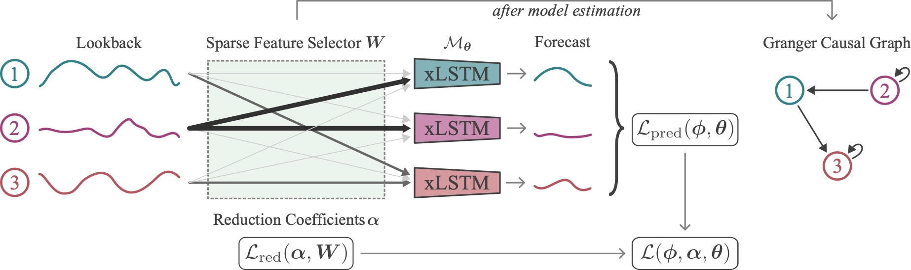
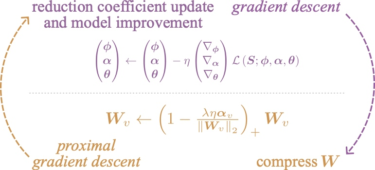

# Exploring Neural Granger Causality with xLSTMs: Unveiling Temporal Dependencies in Complex Data

[](https://neurips.cc/virtual/2025/poster/115199)
[](https://arxiv.org/abs/2502.09981)


Authors: Harsh Poonia*, Felix Divo*, Kristian Kersting, Devendra Singh Dhami  
Accepted to the 39th Conference on Neural Information Processing Systems (NeurIPS 2025).  

## Architecture and Method

*Figure 1: Overview of the GC-xLSTM architecture showing the integration of xLSTM components with dynamic lasso penalty.*



*Figure 2: Illustration of our method's workflow - joint optimization over the forecasting model and compression over weights to identify Granger causal relationships.*


## Requirements

Create a conda environment from the file `environment_pt220cu121.yaml`.  
```bash
conda env create -n xlstm -f environment_pt220cu121.yaml
conda activate xlstm
```

This code has been tested with CUDA 12.1. 
The code for the xLSTM-based modules has been largely adapted from the original [xLSTM repository](https://github.com/NX-AI/xlstm).  

## Datasets

The repository contains all the datasets used in the paper, except ACATIS, which is not open-source. Two simulated datasets, the Lorenz-96 and the VAR dataset, can be created using the `GC-xLSTM/synthetic.py` python script. The other real world datasets are in the `datasets` folder. The `prepare_data.py` script contains the code to return the data, ground truth Granger causal relations (if available), and other information. For MoCap, only the processed numpy files are provided, for two actions: running and salsa dance. The original dataset can be downloaded from [CMU MoCap](http://mocap.cs.cmu.edu/).  


## Demo

When inside the `GC-xLSTM` folder, after activating the conda environment, use the `run.sh` script with a mandatory argument for the config file name. Optionally, you can specify the GPU device to use (defaults to 0). The config file must be in the `configs` folder.    
```bash
./run.sh lorenz/F40T1000.yaml 1
```

## Citation

If you find our work useful, please consider citing our paper using the following BibTeX entry:

```bibtex
@inproceedings{
  poonia2025grangercausality,
  title={Exploring Neural Granger Causality with x{LSTM}s: Unveiling Temporal Dependencies in Complex Data},
  author={Poonia, Harsh* and Divo, Felix* and Kersting, Kristian and Dhami, Devendra Singh},
  booktitle={The Thirty-ninth Annual Conference on Neural Information Processing Systems},
  year={2025},
  url={https://openreview.net/forum?id=xtHJ0eNEUv}
}
```

## Acknowledgements

This project is partially funded by the German Federal Ministry of Education and Research (BMBF) within the “The Future of Value Creation – Research on Production, Services and Work” program (funding number 02L19C150) managed by the Project Management Agency Karlsruhe (PTKA). The authors are responsible for the content of this publication.


